# LQoSync-in-Rust Core Migration Plan

This document defines the `lqosync-in-rust` branch. The goal is to migrate backend authority to Rust while preserving the current operator experience and keeping the existing Flask WebUI as the shell.

```text
Python Flask WebUI stays as the operator interface.
Rust becomes the hardened deterministic backend core.
No database is introduced.
JSON/files remain the source of truth.
LibreQoS remains external and is still applied through LibreQoS.py.
Policy configuration is simplified to Singularity mode instead of multiple operator presets.
```



## Design principles

1. **Preserve working WebUI behavior.** Flask routes, templates, local auth, docs, reports, notifications, and scheduler controls remain Python until a Rust replacement has proven value.
2. **Move dangerous deterministic logic first.** Validation, parsing, diff, topology checks, state writes, and file writes are more important than rewriting screens.
3. **Rust is the safety boundary.** Rust must sit before cleanup, before diff/write/apply decisions, and before file mutation.
4. **No database.** Runtime state remains file-based: `config.json`, `runtime_state.json`, `policy_state.json`, `collector_cache.json`, `audit.jsonl`, `ShapedDevices.csv`, and `network.json`.
5. **No big-bang delete.** Python calls Rust through a stable protocol. Retire Python backend files only after the equivalent Rust live path passes parity and production gates.
6. **Singularity policy.** Keep one safe operator policy mode. Do not port the old Conservative/Balanced/Aggressive preset maze into Rust.

## Current implementation boundary

Current runtime flow:

```text
Flask WebUI / scheduler
  ↓
engine/run_cycle.py
  ↓
MikroTik collectors
  ↓
ShapedDevices.csv + network.json builders
  ↓
preflight + policy engine
  ↓
backup + atomic write
  ↓
LibreQoS.py --updateonly
```

The Rust branch currently has this boundary:

```text
Flask / scheduler / run_cycle.py
  ↓
engine/rust_core.py
  ↓ JSON protocol
rust/lqosync-core
  ↓ JSON result
Python UI / runtime state display
```

Important current state:

```text
Rust already covers:
- scheduler authority gates
- validation/diff/sync plan
- apply manifest/transaction
- transaction journal/rollback contracts
- atomic writes and LibreQoS apply execution when enabled
- RouterOS read planning and read-result validation
- RouterOS shadow collector bundle generation from supplied read results
- gated read-only RouterOS live adapter pilot
- live-read shadow parity bridge from RouterOS results to Rust collector rows
- collector activation readiness derived from repeated dry-run/live-read shadow history
- collector runtime contracts that expose activation provenance without switching authority
- collector switch rehearsals that select Rust shadow rows for diagnostics only
- collector pilot execution contracts that require diagnostics-only Rust row selection before observation
- collector pilot result evaluation that requires diagnostics-only Rust observation evidence before pass
- collector promotion readiness that requires the same diagnostics-only observation proof

Python still covers:
- live RouterOS API reads through routeros-api
- PPPoE/DHCP/Hotspot row generation in the production run cycle
- WebUI shell and compatibility wrappers
```

The next migration target is a Rust pilot handoff manifest that records repeated diagnostics-only observations and prepares the proof bundle for retiring Python backend collectors. The live adapter can execute a single read-only `print` when all gates are enabled, `build-routeros-live-read-shadow-parity` can turn supplied live-read results into diagnostic PPPoE/DHCP/Hotspot rows and parity evidence, `build-run-cycle-rust-shadow-report` can carry that evidence beside the authoritative Python cycle, collector activation can derive successful shadow-cycle counts from that history, the runtime contract exposes that provenance, the switch rehearsal marks Rust rows as diagnostics-only, the pilot execution contract requires that diagnostics-only handoff before observation, the pilot result evaluator requires observed Rust/Python rows from that path before pass, and promotion readiness now refuses readiness without that same observation proof. It still does not replace Python collectors. Once repeated live-read parity, diagnostics-only selection, observation evidence, and the handoff manifest are proven, the Python collector/build/run-cycle modules can be removed.

## Singularity policy target

The policy model is intentionally simplified:

```text
policies.mode = singularity
```

Singularity behavior:

```text
- normal inactive PPP/DHCP/Hotspot rows may clean up after successful collection
- static/manual rows are preserved
- collector failures preserve rows
- enabled source zero-result blocks cleanup
- source-disabled dynamic cleanup requires confirmation and preserves rows until confirmed
- mass-removal guards block cleanup
- medium-risk auto-apply is allowed only after the guardrail verdict remains non-blocking
```

Legacy policy modes `conservative`, `balanced`, and `aggressive` are compatibility aliases only. New Rust backend work should target Singularity and should not add more policy personalities.

## Proposed repository layout

```text
LQoSync/
├─ app.py
├─ engine/
│  ├─ run_cycle.py
│  ├─ rust_core.py              # Python wrapper for Rust CLI/daemon
│  └─ ...
├─ rust/
│  └─ lqosync-core/
│     ├─ Cargo.toml
│     └─ src/
│        ├─ main.rs
│        ├─ lib.rs
│        ├─ protocol.rs
│        ├─ bandwidth.rs
│        ├─ shaped_devices.rs
│        ├─ network.rs
│        ├─ validators.rs
│        ├─ collector_contract.rs
│        ├─ diff.rs
│        ├─ state_store.rs
│        ├─ atomic_write.rs
│        ├─ policy_types.rs
│        └─ error.rs
└─ docs/
   ├─ RUST_CORE_MIGRATION.md
   ├─ RUST_CORE_PROTOCOL.md
   ├─ COLLECTOR_OUTPUT_CONTRACT.md
   ├─ AUTOSAVE_AND_ATOMIC_STATE.md
   └─ COMMIT_AND_PUSH_GUIDE.md
```

## Migration phases

### v0.1 — Rust Validator Core

Purpose: create a safe, testable Rust core without changing production behavior.

Scope:

```text
- Define protocol.rs request/response envelope.
- Implement bandwidth parser with tests.
- Implement ShapedDevices.csv parser with tests.
- Implement network.json parser with tests.
- Validate duplicate IPv4 values.
- Validate missing Parent Node values based on network mode.
- Validate invalid bandwidth fields.
- Validate known policy action names.
- Return structured warnings/errors.
- Add engine/rust_core.py subprocess wrapper.
- Keep Python fallback.
```

Initial operations:

```text
validate-config
validate-shaped-devices
validate-network
validate-files
parse-bandwidth
```

### v0.2 — Rust Diff + Collector Output Contract

Status in `2.72.0-rc1`: partially implemented. The collector trust envelope is enforced in `run_cycle.py` before cleanup eligibility, Python fallback mirrors the Rust contract, and Rust diff operations are available through `diff-files`, `diff-shaped-devices`, and `diff-network`.

Purpose: protect cleanup/diff from silent partial collector results.

Scope:

```text
- Define typed collector result envelope.
- Detect partial reads.
- Detect suspicious zero-result sources.
- Mark source safe_for_cleanup=false when source data is untrusted.
- Generate diff summary for Dry Run.
- Return added/removed/updated clients.
- Return speed changes and parent-node changes.
```

This phase is important because a Python RouterOS library can return an empty list without raising. Exceptions are not the only failure mode. If an enabled source returns zero rows after a previous successful non-zero result, cleanup must not treat that as safe by default.

### v0.3 — Rust Atomic State/File Engine

Purpose: make all critical file mutation typed, atomic, and auditable.

Scope:

```text
- Atomic write for config.json.
- Atomic write for runtime_state.json.
- Atomic write for policy_state.json.
- Atomic write for collector_cache.json.
- Atomic write for ShapedDevices.csv.
- Atomic write for network.json.
- Safe append model for audit.jsonl.
- Backup manifest with checksums.
- Checksum before/after writes.
- Optional rollback metadata.
```

`collector_cache.json` is included intentionally. It is not a harmless cache if future cycles use it for speed/source continuity. A corrupted cache can poison the next run.

### v0.4 — Rust Core Daemon

Purpose: avoid repeated subprocess startup cost once Rust is used during frequent autosave or scheduled sync.

Scope:

```text
- Add optional lqosync-core-daemon.
- Communicate over Unix socket.
- Use exactly the same JSON protocol as CLI mode.
- Python wrapper uses daemon if available.
- Python wrapper falls back to subprocess CLI.
```

The protocol must be finalized in v0.1 so the Python wrapper does not break when the transport changes.

### v0.5 — Rust Policy Decision Engine

Purpose: port policy decisions only after the Policy Center UX and policy semantics are stable.

Scope:

```text
- CleanupAction enum.
- CleanupReason enum.
- Risk score and risk level.
- Confirmation model.
- Write/apply verdict.
- Decision trace.
- Structured policy report.
```

Policy state read/write moves earlier in v0.3. Policy decision logic itself can wait until v0.5.

### v0.6 — Rust Circuit Builder / RouterOS Collector Upgrade

Purpose: move source normalization and possibly RouterOS API collection into Rust after the safety core is stable.

Recommended order:

```text
1. Python reads RouterOS data.
2. Rust validates collector envelope.
3. Rust normalizes raw PPP/DHCP/Hotspot rows.
4. Rust builds typed circuit rows.
5. Only later consider a native Rust RouterOS API client.
```

Do not make the Rust RouterOS API client the first migration target. The first target is safety, not feature replacement.

## What stays Python for now

```text
- Flask routes
- Jinja templates
- local auth/session handling
- Config Center UI
- Policy Center UI
- Setup/Repair UI
- Documentation Center
- Reports pages
- notifications UI
- service monitor/systemctl views
- scheduler control UI
```

## What moves to Rust first

```text
- protocol envelope
- bandwidth parser
- ShapedDevices.csv parser/writer
- network.json parser/tree validator
- preflight validation
- collector output safety contract
- diff engine
- atomic state/file writes
- backup/checksum metadata
```

## Non-goals for early Rust branch

```text
- No full WebUI rewrite.
- No database.
- No forced Axum migration.
- No immediate RouterOS API rewrite.
- No removal of Python fallback during early phases.
```

## Success criteria

The Rust branch is successful when the operator cannot accidentally write unsafe LibreQoS input files from malformed config, partial collector output, invalid topology, duplicate IPs, corrupted state, or suspicious zero-result collector data.

## Current package implementation status

This package includes the first executable scaffold for the `lqosync-in-rust` branch.

Implemented now:

```text
rust/lqosync-core/Cargo.toml
rust/lqosync-core/src/protocol.rs
rust/lqosync-core/src/bandwidth.rs
rust/lqosync-core/src/shaped_devices.rs
rust/lqosync-core/src/network.rs
rust/lqosync-core/src/validators.rs
rust/lqosync-core/src/main.rs
engine/rust_core.py
scripts/build-rust-core.sh
scripts/install-rust-core.sh
```

Runtime behavior:

```text
- Python remains the main runtime path.
- Rust core is optional.
- If the Rust binary is missing, Python fallback stays active.
- Dry Run records rust_core_validation in the result diff.
- Rust validation is non-blocking by default.
- Set rust_core.enforce_validation=true only after testing in lab/staging.
```

The Rust core currently supports these protocol operations:

```text
parse-bandwidth
validate-config
validate-shaped-devices
validate-network
validate-files
validate-collector-output
```

Build commands:

```bash
scripts/build-rust-core.sh
sudo scripts/install-rust-core.sh
```

After installation, LQoSync can discover the binary through:

```text
rust/lqosync-core/target/release/lqosync-core
rust/lqosync-core/target/debug/lqosync-core
/usr/local/bin/lqosync-core
$LQOSYNC_CORE_BIN
```
